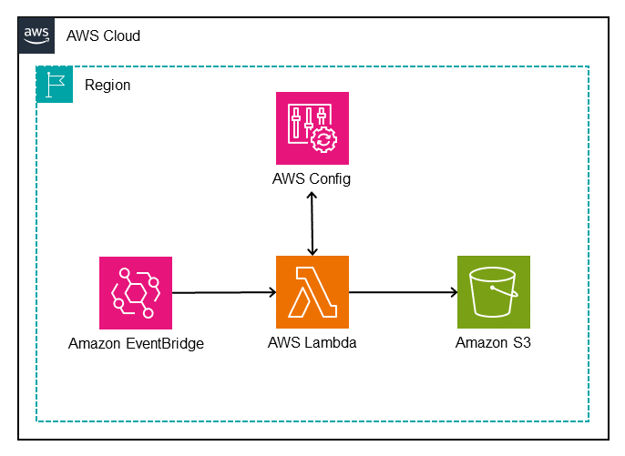
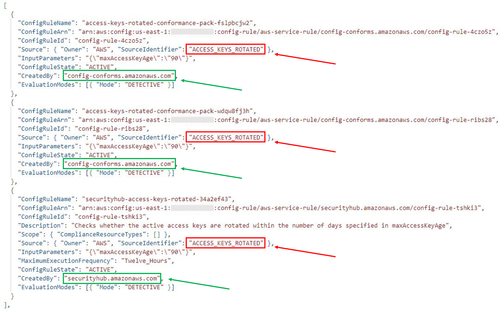
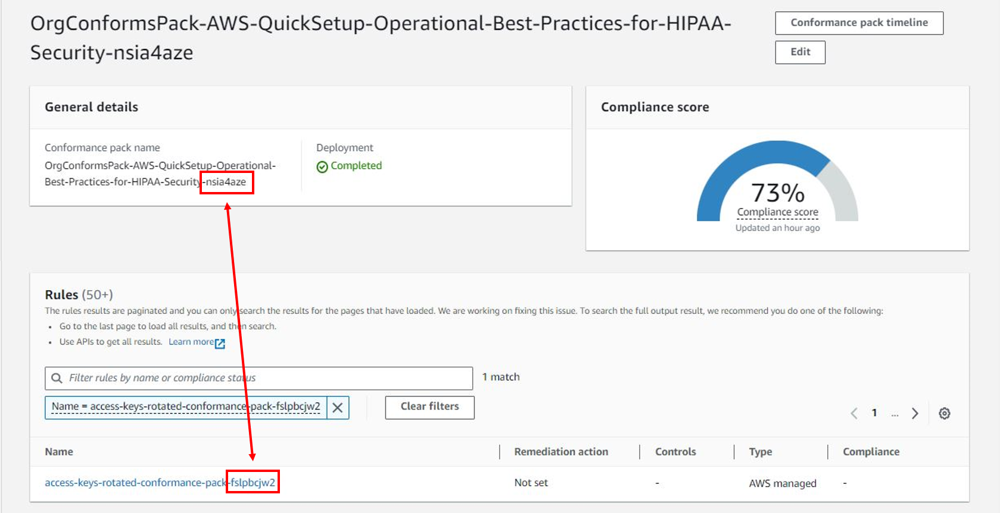
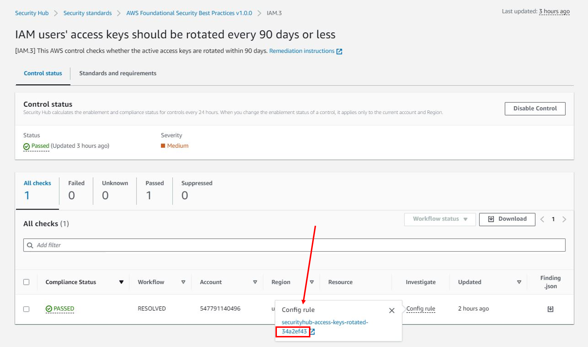

## Table of Contents
1. [Solution Overview](#solution-overview)
2. [Prerequisites](#prerequisites)
3. [Walkthrough](#walkthrough)
4. [CloudFormation Template](#cloudformation-template-review)
5. [Deployment](#deployment)
6. [Duplicate Resolution](#duplicate-resolution)
7. [Clean-up](#clean-up)
8. [Additional Resources](#additional-resourcescall-to-action)
9. [Security](#security)
10. [License](#license)

## Duplicate Rule Detection Tool

[Amazon Web Services (AWS)](https://aws.amazon.com/) customers use various AWS services to migrate, build, and innovate in the AWS Cloud. To meet compliance requirements, customers need to monitor, evaluate, and detect changes made to AWS resources. [AWS Config](https://aws.amazon.com/config/) continuously audits, assesses, and evaluates the configurations of your AWS resources.

[AWS Config rules](https://docs.aws.amazon.com/config/latest/developerguide/evaluate-config_use-managed-rules.html) continuously evaluates your AWS resource configurations for desired settings, AWS Config will evaluate your resources either in response to configuration changes or periodically. AWS Config provides AWS managed rules, which are predefined, customizable rules that are used to evaluate whether your AWS resources comply with common best practices. For example, you could use a managed rule to assess whether your [Amazon Elastic Block Store (Amazon EBS)](https://aws.amazon.com/ebs/) volumes have encryption enabled or whether specific tags are applied to resources. AWS Config rules can be enabled individually or through [AWS Config Conformance Packs](https://docs.aws.amazon.com/config/latest/developerguide/conformance-packs.html), which group rules and remediations together. Customers also have options for deploying AWS Config rules: [AWS Security Hub](https://aws.amazon.com/security-hub/) groups checks against rules together as [standards](https://docs.aws.amazon.com/securityhub/latest/userguide/securityhub-standards.html), and [AWS Control Tower](https://aws.amazon.com/controltower) offers controls through the [Controls Library](https://docs.aws.amazon.com/controltower/latest/controlreference/controls-reference.html). Many AWS customers use a combination of these tools which can create duplicate Config Rules controls in a single AWS account.

In this sample, we introduce our Duplicate Rule Detection tool, built to help customers identify duplicate AWS Config rules and sources. You can assess the results and review opportunities to reduce duplicate evaluations, consolidate rule deployment, and help to optimizing your compliance posture.

## Solution overview

This serverless solution collects the current active AWS Config rules and identifies duplicates based on identical sources, scopes, input parameters, and states.

Figure 1 that follows illustrates the solution.

1. An [Amazon EventBridge Scheduler](https://aws.amazon.com/eventbridge/scheduler/) triggers an [AWS Lambda](https://aws.amazon.com/lambda/) function.
2. The Lambda function completes several tasks:
   1. Sends the _describe-config-rules_ API call to the AWS Config API which returns details about the enabled AWS Config rules in the current AWS account and AWS region.
   2. Iterates through the returned AWS Config rules to determine whether there are duplicate rules. If duplicates are found, they are grouped together in JSON format.
   3. Writes the output to a time-stamped JSON file and saves it to an [Amazon Simple Storage Service (S3)](https://aws.amazon.com/s3/) bucket for further analysis.

## Prerequisites

An AWS account with rules enabled using AWS Config, Security Hub standards or AWS Control Tower controls. Before getting started, make sure that you have a basic understanding of the following:

- [Amazon EventBridge Scheduler](https://docs.aws.amazon.com/scheduler/latest/UserGuide/getting-started.html)
- [AWS Lambda Function](https://docs.aws.amazon.com/lambda/latest/dg/welcome.html)
- Python and [Boto3](https://boto3.amazonaws.com/v1/documentation/api/latest/index.html)

## Walkthrough

To demonstrate the tool, use an AWS account that has two [AWS Config Conformance Packs](https://docs.aws.amazon.com/config/latest/developerguide/conformance-packs.html) deployed ([Operational Best Practices for HIPAA Security](https://docs.aws.amazon.com/config/latest/developerguide/operational-best-practices-for-hipaa_security.html) and [Operational Best Practices for NIST CSF](https://docs.aws.amazon.com/config/latest/developerguide/operational-best-practices-for-nist-csf.html)) along with the [AWS Foundational Security Best Practices (FSBP)](https://docs.aws.amazon.com/securityhub/latest/userguide/fsbp-standard.html) standard in Security Hub.

### CloudFormation template review

The [AWS CloudFormation](https://aws.amazon.com/cloudformation/) template included in this sample deploys several components:

- DuplicateConfigRuleDetectionLambda - A Lambda function that:
  - Sends [describe_config_rules](https://boto3.amazonaws.com/v1/documentation/api/latest/reference/services/config/client/describe_config_rules.html) to AWS Config API to return enabled Config rules
  - Queries the returned rules to identify duplicate rules with identical parameters
  - Writes the date-stamped output JSON file to the S3BucketWhereJSONIsStoredFromDuplicateConfigRuleDetectionLambda bucket
- PolicyForIAMRoleForDuplicateConfigRuleDetectionLambda - An IAM policy attached to the IAMRoleForDuplicateConfigRuleDetectionLambda role that allows access to:
  - Basic Lambda Execution Permissions
  - config:DescribeConfigRules
  - s3:PutObject with a constraint to only allow on the S3BucketWhereJSONIsStoredFromDuplicateConfigRuleDetectionLambda bucket
- IAMRoleForDuplicateConfigRuleDetectionLambda - An IAM role with a trust policy to allow only the AWS Lambda service to assume
- S3BucketWhereJSONIsStoredFromDuplicateConfigRuleDetectionLambda - An Amazon S3 bucket for storing the output JSON files written by the DuplicateConfigRuleDetectionLambda function
- SchedulerForDuplicateConfigRuleDetectionLambda - EventBridge Scheduler used to trigger the DuplicateConfigRuleDetectionLambda
  - ScheduleExpression - Property to define when the schedule runs
- IAMRoleforDuplicateConfigRuleDetectionLambdaScheduler - An IAM role for SchedulerForDuplicateConfigRuleDetectionLambda with IAM inline policy to allow Lambda invocation

### Deployment

1. Download the DuplicateConfigRuleDetectionCloudformationTemplate.yml CloudFormation template from this GitHub repository.
   _(Note: The default frequency of the EventBridge Scheduler is to run on the first day of each month. Update the template CRON expression as needed before creating the stack.)_
2. Sign in to the AWS Management console and navigate to **AWS CloudFormation** by using the search feature at the top of the page.
3. In the navigation pane, choose **Stacks**.
4. At the top of the **Stacks** page, choose **Create Stack**, then select **With new resources** from the dropdown menu.
5. On the **Create stack** page
   1. For **Prerequisite - Prepare template**, leave the default setting **Template is ready**
   2. Under **Specify template**, choose **Upload a template file**, then select the downloaded DuplicateConfigRuleDetectionCloudformationTemplate.yml template and choose **Open**.
6. At the bottom of the page, choose **Next**.
7. On the **Specify stack details** page
   1. For **Stack name**, enter a name for the Stack, for example, **_duplicate-detection-rule-stack_**.
8. At the bottom of the page, choose **Next**.
9. On the **Configure stack options** page
   1. (Optional) For Tags, add tags as needed.
   2. For **Permissions**, don't choose a role, CloudFormation uses permissions based on your user credentials.
   3. For **Stack failure options**, leave the default option to **Roll back all stack resources**
10. At the bottom of the page, choose **Next**.
11. On the **Review** page, review the details of your stack. 
12. After you review the stack creation settings, choose **Create stack** to launch your stack
13. From the **CloudFormation Stack** page, monitor the status of the stack as it updates from **CREATE_IN_PROGRESS** to **CREATE_COMPLETE**. You may need to refresh the page to view updates.
14. From the **Resources** tab, you will see the resources that were created from the template.

### Test

_Use the steps below to invoke the Lambda function to create a one-time output for testing._

1. Sign in to the **AWS CloudFormation** console.
2. From the navigation pane, choose **Stacks** and then click on the **Stack name** you used when deploying this solution.
3. Choose the **Resources** tab in the _duplicate-detection-rule-stack_ and note the name of the Lambda function created for this solution.
4. Navigate to the **Lambda** console and choose **Functions** from the navigation pane.
5. Select the function name noted in Step 3.
6. From the **Code** tab, click on the **Test** button, which will open a test window, then choose **Invoke**.
7. Navigate to the **Amazon S3** console and select the bucket name that was created as part of this solution to see the JSON output created by the Lambda function.
8. Select the object and choose **Download** to view the output locally.

### Validation

To view the JSON output file and understand the structure, open the downloaded outputfile with a text editor that supports JavaScript Objection Notation (JSON). Each duplicate rule is presented as a JSON object defined within left ({) and right (}) braces. Matching duplicate rules are grouped together in an array within left ([) and right (]) brackets and separated by commas.

From the sample output that follows, you can see that there are three instances of the same AWS Config managed rule in this account:
- The first two rules are deployed from two different conformance packs and the third rule was created by Security Hub.
- The SourceIdentifier key value identifies the managed rule as ACCESS_KEYS_ROTATED.
- The CreatedBy key value identifies the service that enabled the rule.

Each rule has the same InputParameters, which is a qualifier for how a duplicate rule is defined.

Now that you’ve identified the duplicate rules, further investigation is needed to identify the specific conformance pack and Security Hub standards that the rule is included in. The ConfigRuleName value is different for each duplicate rule and includes prefixes and suffixes based on how the rule was deployed:
- Rules deployed using conformance packs will include a suffix to the displayed AWS Config rule name (for example, access-keys-rotated-conformance-pack-a1b2c3d4e).
- Rules deployed using Security Hub standards include both a prefix and a suffix to the displayed AWS Config rule name (for example, securityhub-access-keys-rotated-a1b2c3).
- Rules deployed using AWS Control Tower include a prefix to the displayed AWS Config rule name (for example, AWSControlTower_AWS-GR_EBS_OPTIMIZED_INSTANCE).

The ConfigRuleName value maps back to the specific conformance pack or Security Hub standard.

1.	From the **AWS Config** console, choose **Conformance pack** from the navigation pane. Select a conformance pack and search the rules by filtering with the SourceIdentifier value from the output file.

To identify which Security Hub standards the rule is enabled with, use the following steps.

2.	Using the AWS Config Developer Guide, search the [List of Managed Rules](https://docs.aws.amazon.com/config/latest/developerguide/managed-rules-by-aws-config.html) using the SourceIdentifier and note the Resource Types for the managed rule (for example, AWS::IAM::User).
3.	Use the [Security Hub controls reference](https://docs.aws.amazon.com/securityhub/latest/userguide/securityhub-controls-reference.html) to search for the AWS service that was included in the Resource Type from the previous step (that is, the IAM controls).
4.	Search for the corresponding control by using the SourceIdentifier and note the Control ID (that is, IAM.3).
5.	Sign in to the **Security Hub** console and choose Controls from the navigation pane. Search for the Control ID by filtering on ID and select the Control Title.
6.	Choose the Investigate tab and select the Config rule to view the corresponding AWS Config rule.
7.	Select the Standards and requirements tab on the Control page to view the standards that the AWS Config rule is a part of.

## Duplicate Resolution

After the assessment is complete and duplicate rules are identified, you can work to consolidate rules and resolve duplicates.

If the AWS account being evaluated is part of an [AWS Organizations](https://aws.amazon.com/organizations/), a delegated administrator account in the Organization may be registered to [manage specific AWS services](https://docs.aws.amazon.com/organizations/latest/userguide/orgs_integrate_services_list.html), such as [AWS Config](https://docs.aws.amazon.com/config/latest/developerguide/aggregated-register-delegated-administrator.html) and [Security Hub](https://docs.aws.amazon.com/securityhub/latest/userguide/securityhub-accounts.html). Resolution might need to be completed from the delegated administrator account.

Some options customers can take to resolve duplicate AWS Config rules include:

- If conformance packs were deployed from [AWS Systems Manager Quick Setup](https://docs.aws.amazon.com/systems-manager/latest/userguide/quick-setup-cpack.html), then only sample templates are available, which can’t be modified. Customers can instead [create templates for custom conformance packs](https://docs.aws.amazon.com/config/latest/developerguide/custom-conformance-pack.html) and [deploy them directly from AWS Config](https://docs.aws.amazon.com/config/latest/developerguide/conformance-pack-deploy.html).
- If conformance packs were deployed from the Config dashboard and sample templates were used, then customers can create templates for custom conformance packs and deploy them directly from AWS Config.
- If standards are enabled in Security Hub, [individual controls can be disabled](https://docs.aws.amazon.com/securityhub/latest/userguide/securityhub-standards-enable-disable-controls.html) to prevent redundancy.
- If controls are deployed from the Control Tower Controls Library, [controls can be enabled or disabled as needed from the Control Tower](https://docs.aws.amazon.com/controltower/latest/controlreference/enable-controls-on-ou.html) console or programmatically with [supporting APIs](https://docs.aws.amazon.com/controltower/latest/APIReference/Welcome.html).

When deciding on an effective approach to consolidate rules and resolve duplicates, it is helpful to consider additional capabilities such as visualization and automated remediation:

- AWS Config provides a [dashboard](https://docs.aws.amazon.com/config/latest/developerguide/viewing-the-aws-config-dashboard.html) to view resources, rules, conformance packs, and their compliance states. Customers can also [configure remediation](https://docs.aws.amazon.com/AWSCloudFormation/latest/UserGuide/aws-resource-config-remediationconfiguration.html) actions in custom templates to target [AWS Systems Manager Automation runbooks](https://docs.aws.amazon.com/systems-manager-automation-runbooks/latest/userguide/automation-runbook-reference.html) that define the actions that Systems Manager performs.
- Security Hub provides a [summary dashboard](https://docs.aws.amazon.com/securityhub/latest/userguide/dashboard.html) to identify areas of concern, including aggregating findings across an AWS Organization. Customers can customize the dashboard layout, add or remove widgets, and filter the data to focus on areas of particular interest. To configure [automated response and remediation](https://docs.aws.amazon.com/securityhub/latest/userguide/securityhub-cloudwatch-events.html), Security Hub automatically sends new findings and all updates to existing findings to EventBridge as EventBridge events. Customers can write simple rules to indicate which events and what automated actions to take when an event matches a rule.
- AWS Control Tower provides a console to view control categories, individual controls, and status along with enabled OUs and/or accounts. Remediation for non-compliant resources is currently not supported through Control Tower.

The best approach for consolidating rules and resolving duplicates should be an assessment of the factors listed above along with developing a strategy for governance at scale. Security Hub provides a comprehensive view of compliance across an AWS Organization by collecting security data across AWS accounts, AWS services, and supported third-party products. Enabling one of more Security Hub standards provides a mechanism to deploy controls without risk of duplication. You can deploy additional controls individually from AWS Config or Control Tower.

## Clean up

Use the following steps to remove the resources you created in this walkthrough:

1. Sign in to the **AWS CloudFormation** console and choose  **Stacks** from the navigation pane.
2. Select the **Stack name** you used when deploying this solution.
3. Choose to the **Resources** tab in the _duplicate-detection-rule-stack_ console and note the name of the S3 bucket created for this solution.
4. Navigate to the **Amazon S3** console.
5. Click the radio button next to the bucket noted in Step 3 and click on the **Empty** button and follow additional steps to empty the bucket.
6. Navigate to the **AWS CloudFormation** console and choose **Stacks** from the navigation pane.
7. Select the radio button next to the stack name used in the deployment step and select **Delete**.
8. Choose **Delete** to confirm that you want to delete the stack.
9. From the CloudFormation Stack page, monitor the status of the stack as it updates from **DELETE_IN_PROGRESS** to **DELETE_COMPLETE**.

## Additional Resources/Call to Action

**This sample code is not intended to be used in your production accounts without testing, securing, and optimizing the content based on your specific quality control practices and standards. Deploying this sample code may incur AWS charges for creating or using AWS chargeable resources, such as running Amazon EC2 instances or using Amazon S3 storage.**

## Below are some additional configurations that should be implemented when deploying this solution to align with security best practices.

When you set permissions with IAM policies, grant only the permissions required to perform a task. You do this by defining the actions that can be taken on specific resources under specific conditions, also known as least-privilege permissions. Some IAM actions (ex. config:DescribeConfigRules in this solution) only support the all resources wildcard("\*"). In such use cases, further consideration can be taken with the use of AWS global condition context keys (https://docs.aws.amazon.com/IAM/latest/UserGuide/reference_policies_condition-keys.html) and will be based on individual requirements.

AWS Lambda function should be deployed inside a VPC for additional networking configurations, such as access to define the VPC security groups and subnets that are attached to a Lambda function. When you connect a function to a VPC, Lambda creates an elastic network interface for each combination of security group and subnet in the function's VPC configuration.
Lambda Developer Guide - https://docs.aws.amazon.com/lambda/latest/dg/foundation-networking.html
CloudFormation resource reference - https://docs.aws.amazon.com/AWSCloudFormation/latest/UserGuide/aws-properties-lambda-function-vpcconfig.html

Monitoring Amazon Simple Storage Service (S3) buckets should include logging server access. Server access logging provides detailed records for the requests that are made to a bucket.
S3 User Guide - https://docs.aws.amazon.com/AmazonS3/latest/userguide/ServerLogs.html
CloudFormation resource reference - https://docs.aws.amazon.com/AWSCloudFormation/latest/UserGuide/aws-properties-s3-bucket-loggingconfiguration.html

Amazon S3 applies server-side encryption with Amazon S3 managed keys (SSE-S3), by default, as the base level of encryption for every bucket in Amazon S3. Other encryption options are also available and should be implemented, including specifying server-side encryption with AWS KMS-managed keys (SSE-KMS)
S3 User Guide - https://docs.aws.amazon.com/AmazonS3/latest/userguide/serv-side-encryption.html
CloudFormation resource reference - https://docs.aws.amazon.com/AWSCloudFormation/latest/UserGuide/aws-properties-s3-bucket-bucketencryption.html

## Security

See [CONTRIBUTING](CONTRIBUTING.md#security-issue-notifications) for more information.

## License

This library is licensed under the MIT-0 License. See the [LICENSE](LICENSE) file.